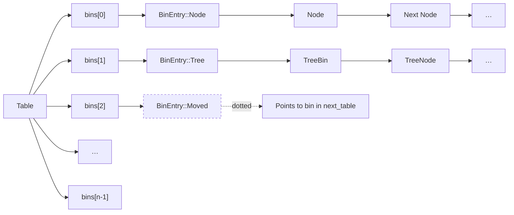
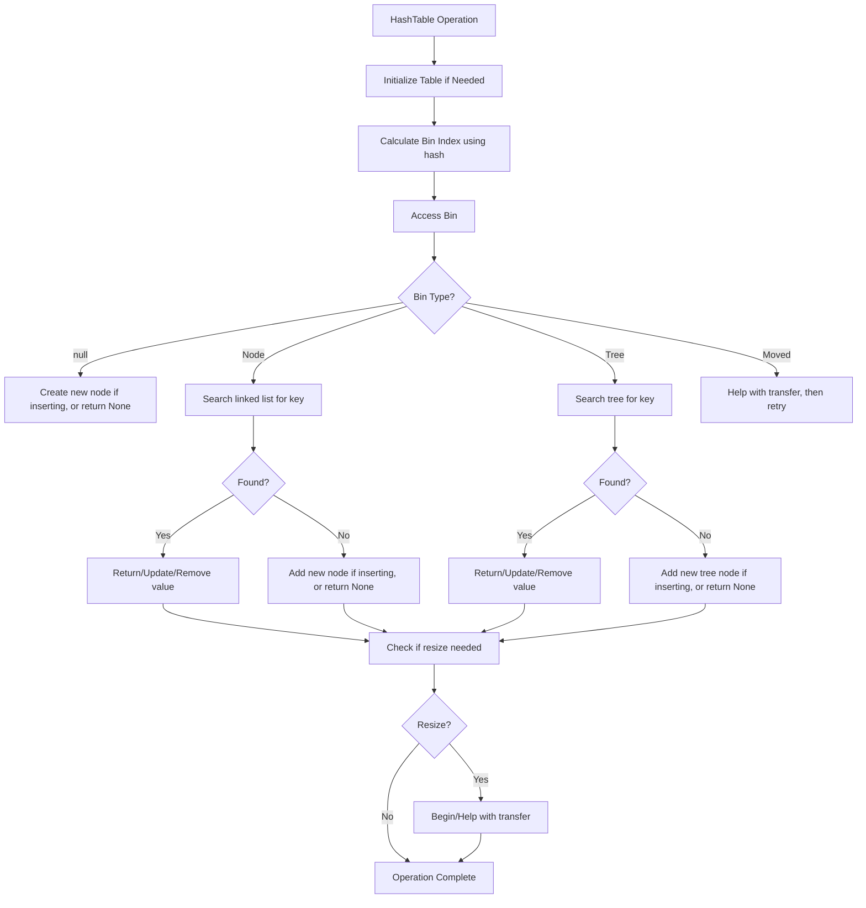

# Concurrency

https://deepwiki.com/search/create-a-step-by-step-exercise_6eed9a30-576c-40d0-82fb-a6374b5c44a3

## Lock-free Insertion

How is **inserting to empty bins** implemented?
1. hash key to determine bin index
2. use CAS to atomically insert first node in empty bin
3. handle CAS failures and retry logic (built into the main loop structure of the put method)

classic lock-free pattern: attempt the operation optimistically, and if it fails due to concurrent modification, retry with the updated state.

```rust
use std::sync::atomic::Ordering;

impl HashMap {
    fn put(&mut self, key: K, value: V) {
        // 1.hash key to bin index
        let hash = self.hash(&key);
        // subtracting 1 yields a bit mask whose low n bits are all 1 (e.g. 16 → 0b1111).
        // bitwise AND keeps only the low bits.
        // bitwise-AND == hash % capacity without a hardware divide -> faster.
        let mask = self.table.bins.len() as u64 - 1;
        let bin_index = (hash & mask) as usize;

        // 2. use CAS to atomically insert first node in empty bin
        loop {
            // continues until operation succeeds
            let mut bin = table.bin(bin_index, guard);
            // fast path when the bin is empty - by far the most common case for put operations under most key/hash distributions.
            // That's why it's optimized to be lock-free and avoid the overhead of acquiring locks when bins are empty.
            if bin.is_null() {
                // create node to be inserted to table bin
                let node = Shared::boxed(BinEntry::Node(Node::new(hash, key, value)), &self.collector);
                // attempt CAS, might fail if concurrent threads insert to same bin
                match self.table.cas_bin(bin_index, bin, node, guard) {
                    Ok(_old_null_ptr) => {
                        // If successful, increments the count and returns inserted value
                        sel.add_count(1, guard);
                        return PutResult::Inserted { new: unsafe { value.deref() } };
                    }
                    // 3. handle CAS failures and retry logic
                    // another thread inserted to the bin concurrently
                    Err(changed) => {
                        bin = changed.current; // update bin variable to current bin content
                        key = node.key; // extract key from failed node attempt
                        // outer loop continues, next iteration handle non-empty bin case
                    }
                }
            }
            // slow path -- bin is non-empty
            // skip here ...
        }
    }
}

impl Table {
    fn cas_bin(
        &mut self,
        bin_index: usize,
        current: Shared<BinEntry>,
        new: Shared<BinEntry>,
        guard: &Guard,
    ) -> Result<BinEntry, CompareExchangeError<BinEntry>> {
        // internally this uses AtomicPtr.compare_exchange from stdlib
        // AtomicPtr: A raw pointer type which can be safely shared between threads.
        // impl<T> AtomicPtr<T>.compare_exchange(...) -> Stores a value into the pointer if the current value is the same as the current value.
        // Note: This method is only available on platforms that support atomic operations on pointers.
        // https://doc.rust-lang.org/core/sync/atomic/struct.AtomicPtr.html#method.compare_exchange
        self.bins[bin_index].compare_exchange(
            current,
            new,
            Ordering::AcqRel,
            Ordering::Acquire,
            guard,
        )
    }
}
```

Examples: table has 16 buckets `bins_len = 16, mask = 0x0F`

| Key        | 64-bit hash (hex)       | `hash & 0x0F` | Index            |
| ---------- | ----------------------- | ------------- | ---------------- |
| `"apple"`  | `0xDEADBEEFCAFEBABE`    | `0xE`         | `14`             |
| `"orange"` | `0x1234_5678_90AB_CDEF` | `0xF`         | `15`             |
| `"pear"`   | `0x0F00_F00D_BAAD_CAFE` | `0xE`         | `14` (collision) |

Table bins structure


Table operation flow chart
