# Guard and Memory Management

<!-- TOC -->
* [Guard and Memory Management](#guard-and-memory-management)
  * [Overview](#overview)
  * [Why need Guard?](#why-need-guard)
  * [How Guard works?](#how-guard-works)
    * [Cleaning up in runtime or compile-time?](#cleaning-up-in-runtime-or-compile-time)
  * [Alternatives](#alternatives)
    * [Arc](#arc)
<!-- TOC -->

## Overview
Context:
- Operations that access or modify data require a Guard to ensure memory safety.
- Flurry uses a guard-based memory management system provided by `seize` crate to ensure safe concurrent access.

```rust
let map: HashMap<i32, String> = HashMap::new();
// pin the current epoch
let guard = map.guard();

map.insert(1, "one".to_string(), &guard);
let value = map.get(&1, &guard);
map.remove(&1, &guard);
// when guard drops, thread is unpinned
```

```rust
use flurry::HashMap;

let map = HashMap::new();

// Writer thread
map.insert(42, "hello");

// Reader thread
let guard = map.guard(); // Pin epoch
if let Some(value) = map.get(&42, &guard) {
    // Safe to use value here
    println!("{}", value);
} 
// guard drops, unpinning epoch

// NEVER do this:
// let guard = map.guard();
// let value = map.get(&42, &guard);
// drop(guard); // Drops too early!
// println!("{}", value); // Use-after-free!
```

## Why need Guard?
- Java's ConcurrentHashMap relies on Java's GC, but Rust doesn't have runtime GC.
- it's a memory safety mechanism.
- it prevents **premature deallocation** of shared data in concurrent operations.

## How Guard works?

When values are removed from the map, they go through a retirement process rather than immediate deallocation.
- Each thread pins itself (creates a Guard) before touching the map. 
- Readers can load a value and use it for the lifetime of that guard. 
- Writers retire removed values via retire_shared; real freeing is delayed until all guards from the epoch in which the value was retired have been dropped.

```mermaid
sequenceDiagram
    participant T1 as "Thread 1"
    participant T2 as "Thread 2"
    participant HM as HashMap
    participant GC as "seize::Collector"
    participant MEM as Memory

    %% --- Thread 1 reads ------------------------------
    T1->>HM: guard()
    HM->>GC: enter()
    GC-->>T1: Guard (marks thread active)
    T1->>HM: get(key,&guard)
    HM->>MEM: load value
    MEM-->>HM: value
    HM-->>T1: reference to value

    %% --- Thread 2 removes ----------------------------
    T2->>HM: guard()
    HM->>GC: enter()
    GC-->>T2: Guard (marks thread active)
    T2->>HM: remove(key,&guard)
    HM->>GC: retire_shared(old_value)
    Note over GC: Value marked for cleanup but not freed

    %% --- Guards dropped ------------------------------
    T1->>GC: drop guard
    Note over GC: Thread 1 no longer active
    
    T2->>GC: drop guard
    Note over GC: Thread 2 no longer active
    
    %% --- Reclamation --------------------------------
    GC->>MEM: Safe to reclaim retired values
```



### Cleaning up in runtime or compile-time?
- cleaning up or entries having no more reference happens at runtime.
- (using crossbeam-epoch), cleanup happens opportunistically in user-threads, there's no GC thread.
- `work stealing`: threads that create guards help clean up garbage from all threads.

Example
```rust
// Thread A
map.insert(1, "a");
map.remove(&1);  // Item goes to Thread A's garbage bag

// Thread B  
// Thread B might clean Thread A's garbage!
// IF conditions are met (all threads past epoch)
let guard = map.guard();  

// Thread C
map.insert(2, "b");  // Might also trigger cleanup of old garbage
```

Mechanism
```rust
// Simplified view of what happens inside crossbeam-epoch
// THRESHOLD 32 or 64 items
impl Local {
    fn pin(&self) -> Guard {
        // 1. Pin to current epoch
        let guard = self.inner.pin();
        
        // 2. Check if we should help with cleanup
        if self.garbage_count() > THRESHOLD {
            // 3. This thread tries to advance the global epoch
            self.try_advance_epoch();
            
            // 4. Collect garbage from old epochs
            self.collect_garbage();
        }
        
        guard
    }
}
```

## Testing

https://github.com/jonhoo/flurry/blob/c0a84ac093d73b69916ed873ca8a9119b08d177b/tests/basic.rs#L365-L381
```rust

```

## Alternatives
1. Runtime Garbage Collection - Java's ConcurrentHashMap relies on Java's GC, but Rust doesn't have runtime GC
2. Atomic Reference Counting - Would be less efficient than the batch reference-counting approach used by seize
3. Global Locks - Would eliminate the concurrency benefits that make concurrent hash maps valuable

| Approach | Pros | Cons | Best Use Case |
|----------|------|------|---------------|
| **Guards/EBR** (flurry) | ✅ Very low read overhead (just local counter)<br>✅ No per-object memory overhead<br>✅ Batched reclamation (efficient)<br>✅ Natural Rust API with lifetimes<br>✅ Excellent cache locality<br>✅ Scales well with read-heavy workloads | ❌ Memory can accumulate if thread stays pinned<br>❌ Can't hold guards across blocking ops<br>❌ Coarse-grained (protects everything in epoch)<br>❌ Requires careful API design<br>❌ Unbounded memory in pathological cases | Lock-free data structures with frequent reads, short critical sections |
| **Reference Counting** (Arc) | ✅ Simple and familiar API<br>✅ Immediate reclamation<br>✅ Works with any data structure<br>✅ Predictable memory usage<br>✅ No special guards needed<br>✅ Safe across async boundaries | ❌ High overhead (atomics on every clone/drop)<br>❌ Cache line contention<br>❌ Can't handle cyclic references<br>❌ Poor scalability under contention<br>❌ Extra indirection | Simple concurrent access, clear ownership patterns, async code |
| **Hazard Pointers** | ✅ Bounded memory usage<br>✅ Fine-grained protection<br>✅ Can protect specific pointers<br>✅ Works with long operations<br>✅ Predictable worst-case memory | ❌ Higher per-operation overhead<br>❌ Complex API (manual protection)<br>❌ Limited number of pointers<br>❌ Requires careful pointer tracking<br>❌ More bookkeeping | Long-running operations, systems requiring bounded memory |
| **RCU** | ✅ Extremely low read overhead<br>✅ Wait-free reads<br>✅ Good for read-dominated workloads<br>✅ Proven in OS kernels<br>✅ Allows complex read-side operations | ❌ Writers must wait for grace periods<br>❌ Complex implementation<br>❌ Not native to Rust ecosystem<br>❌ Can have high write latency<br>❌ Memory usage spikes during updates | Read-dominated workloads (99%+ reads), OS/systems programming |
| **Garbage Collection** | ✅ Fully automatic<br>✅ No manual lifetime management<br>✅ Handles cycles naturally<br>✅ Simple programming model<br>✅ No guards or special types | ❌ Not available in Rust<br>❌ Unpredictable latency (GC pauses)<br>❌ Memory overhead<br>❌ No control over reclamation<br>❌ Requires runtime support | Not applicable in Rust |
| **Locks** (RwLock/Mutex) | ✅ Simple and safe<br>✅ Predictable behavior<br>✅ Works with any data<br>✅ Good tooling support<br>✅ Easy to reason about | ❌ High contention overhead<br>❌ Can cause deadlocks<br>❌ Poor scalability<br>❌ Reader-writer conflicts<br>❌ Not lock-free | Simple cases, correctness over performance |

| If you need... | Choose... |
|----------------|-----------|
| 🚀 Maximum read performance | Guards/EBR |
| 🎯 Simplicity | Arc or Locks |
| 📏 Bounded memory | Hazard Pointers |
| ⚡ Async compatibility | Arc |
| 📖 99%+ read workload | RCU (if available) |
| 🔧 Complex data structure internals | Guards/EBR |
| ⏳ Long blocking operations | Hazard Pointers or Arc |
| ⏱️ Predictable latency | Hazard Pointers or Arc |

### Arc
```rust 
type Value = Arc<T>;
```